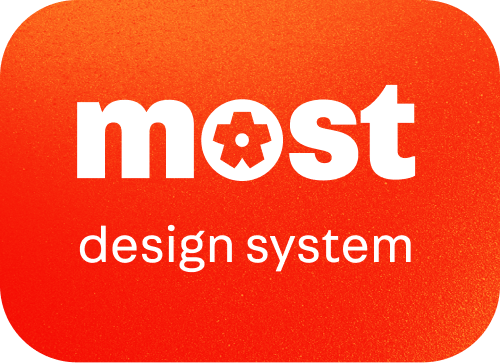

# most design system



The _most design system_ is a meticulously crafted experience which delivers a
user-centric, approachable and modernistic user experience across more retail's
digital platforms.

# Installation

You can install the most design system as a regular dev dependency.

```bash
npm install --save-dev most-design-system
```

Or with `pnpm`

```bash
pnpm install --dev most-design-system
```

# Usage

## Most Design Tokens

The _most design tokens_ express micro design decisions that frames the _most
design system's_ visual style.

### JavaScript

To use _most design tokens_ in JavaScript frameworks, import most's design
tokens as JavaScript objects.

```js
import tokens from "most-design-system/tokens/js";
```

And use the tokens according to your framework's styling syntax.

```js
// src/App.jsx
<h1
  style={{
    color: tokens.colors.orange[60],
    fontSize: tokens.typography.head[10].fontSize,
  }}
>
  Most Design System
</h1>
```

You can also use the tokens to style in vanilla JavaScript if required.

### React Native

Import _most design tokens_ as JavaScript objects formatted for React Native.

```js
import tokens from "most-design-system/tokens/react-native";
```

And use the tokens as you want.

```js
// src/App.jsx
<Text
  style={{
    color: tokens.colors.orange[60],
    fontSize: tokens.typography.head[10].fontSize,
  }}
>
  Most Design System
</Text>
```

### CSS

Import _most design tokens_ as CSS variables

```css
/* src/App.css */
@import "most-design-system/tokens/css";
```

And start using them anywhere where you can use CSS variables

```css
/* src/App.css */

h1 {
  color: var(--colors-orange-60);
  font: var(--typography-para-30);
}
```

### Tailwind

Import _most design tokens_ as Tailwind v4's CSS configuration.

```css
/* src/globals.css */

@import "most-design-system/tokens/tailwind";
```

And start using _most design tokens_ as Tailwind classes.

```jsx
// src/App.jsx

function App() {
  return {
    <>
      <h1 className="text-orange-60 typography-label-10">Most Design System</h1>
    </>
  }
}
```

For projects using Tailwind versions earlier than v4, in your
`tailwind.config.js`, import and set up all the regular and [composite
tokens](https://design-tokens.github.io/community-group/format/#composite-types).

```js
// tailwind.config.js

// Import JS tokens for regular tokens
import jsTokens from "most-design-system/tokens/js";
// Import CSS-in-JS tokens for composite tokens
import cssInJsTokens from "most-design-system/tokens/css-in-js";
// Import the plugin function to be able to add your composite tokens
import plugin from "tailwindcss/plugin";

export default {
  content: ["./src/**/*.{html,js,jsx,ts,tsx}"],
  // To completely replace the default values, for example, color, add the
  // tokens directly under the theme property. Here, for colors, we are also
  // adding two defaults back - "transparent" and "currentColor"
  theme: {
    colors: {
      transparent: "transparent",
      current: "currentColor",
      ...jsTokens.colors,
    },
  },
  // To add and use composite tokens, register them as new styles in
  // Tailwind's "utility" layer
  plugins: [
    plugin(({ addUtilities }) => {
      addUtilities(cssInJsTokens);
    }),
  ],
};
```

And start using _most design tokens_ as Tailwind classes.

```jsx
// src/App.jsx

function App() {
  return {
    <>
      <h1 className="text-orange-60 typography-label-10">Most Design System</h1>
    </>
  }
}
```

## Components

Coming soon!

# License

MIT
